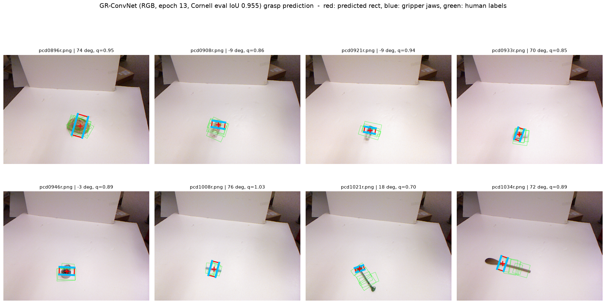
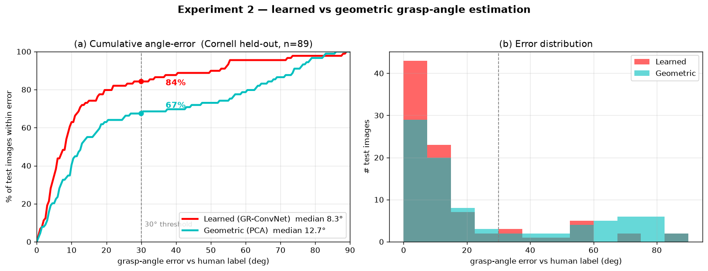
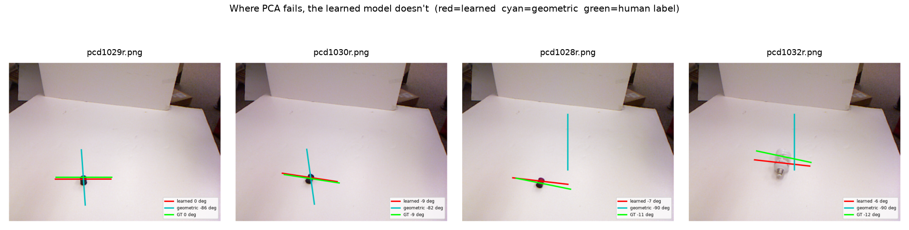
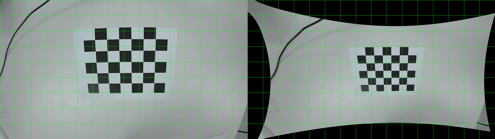
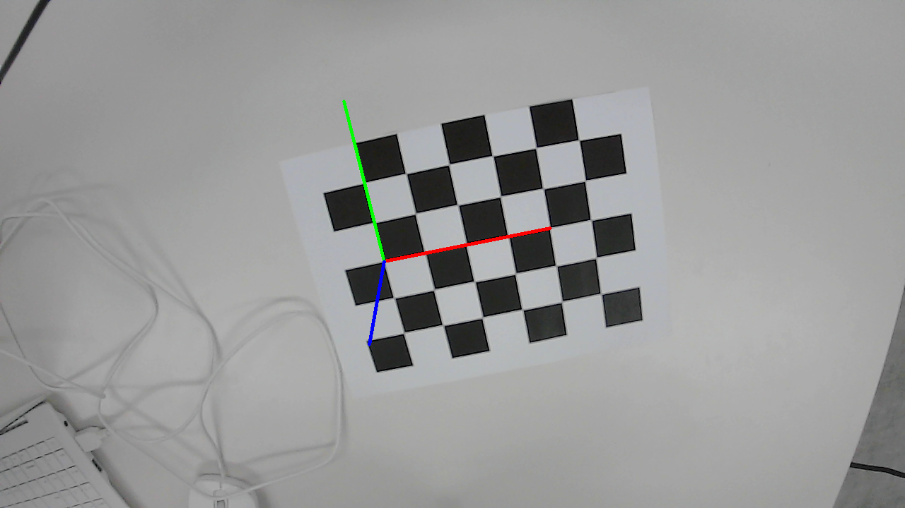
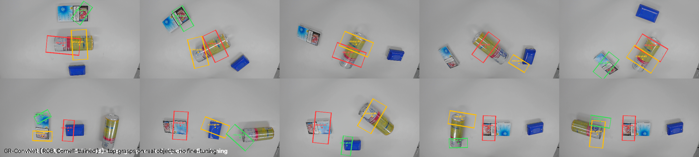
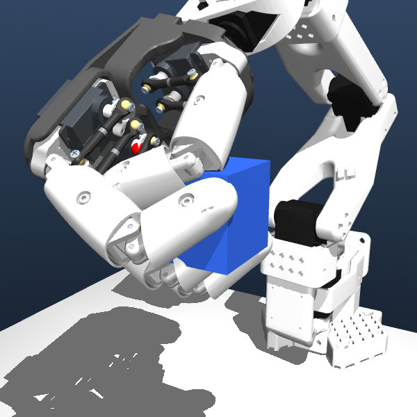
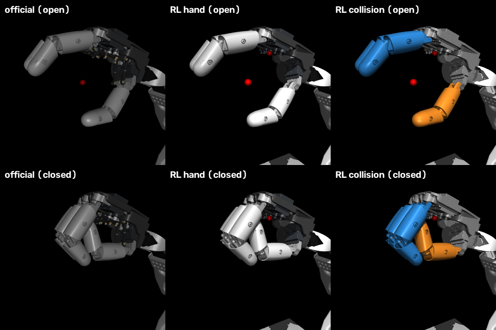
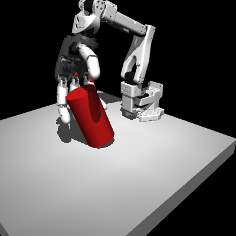
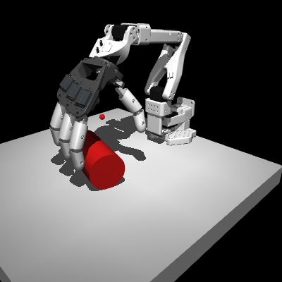

# 저가형 단안 카메라 파지 로봇의 파지 각도 자동 검출

RGB 이미지 **한 장**에서 책상 위 물체를 **어디서, 몇 도로** 집을지 예측하고,
고정 카메라 캘리브레이션으로 3D 파지 자세를 복원한 뒤,
**SO-101 팔 + AmazingHand**로 실행합니다. 깊이 센서·모션캡처 없이 시중 부품만 씁니다.

```
  RGB 프레임 ──▶ GR-ConvNet ──▶ (u, v, θ, 폭, q)      이미지 속 파지
             └─▶ 카메라 모델 (K, 왜곡, T_base_cam) ──▶ 광선 ∩ 테이블 평면
             └─▶ 로봇 기준 3D 파지 자세 (x, y, z, yaw, 폭)
             └─▶ IK ──▶ 팔 이동 ──▶ 쥐기 ──▶ 들기
```

## 제약 (의도한 것)

| 선택 | 이유 |
|---|---|
| **RGB 단안만** — 깊이 카메라 없음 | 최근 RGB 전용 파지 연구와 맞추고, 비싼 센서를 뺍니다. 높이는 픽셀 광선과 이미 아는 테이블 평면의 교점으로 기하학적으로 구합니다 |
| **고정 카메라** (eye-to-hand) | 캘리브레이션 한 번으로 세션 내내 유효 |
| **SO-101 + AmazingHand**, Raspberry Pi / LeKiwi 베이스 없음 | 저가형 탁상 구성. 이동 베이스는 뺐습니다 |
| **1자유도로 묶은 쥐기** | 연구 기여는 *인식*이고, 손은 실제 AmazingHand처럼 열기/닫기 명령 하나로 움직이는 실행기입니다 |

---

## 1 · 파지 모델 — GR-ConvNet, RGB만

- `models/grconvnet.py` — 완전 합성곱 구조. 합성곱 줄기 → 잔차 블록 5개 → 2배 쌍선형
  업샘플 → 300×300 해상도의 `pos / cos / sin / width` 출력. 파라미터 약 183만 개.
- **Cornell Grasping Dataset**(이미지 885장)으로 RGB만 사용해 학습(`input_channels = 3`).
- 배포 가중치: `output/models/final_grconvnet_rgb1_d0/weights.pt` (`MODEL.md` 참고).

### 이미지 단위 5-fold 교차검증 (`run_cv.ps1`, fold당 25 epoch)

| fold (`--ds-rotate`) | 검증 IoU (Jaccard 25% 겹침, 각도 30° 이내) |
|---|---|
| 0.0 | 0.944 |
| 0.2 | 0.831 |
| 0.4 | 0.843 |
| 0.6 | 0.944 |
| 0.8 | 0.955 |
| **평균 ± 표준편차** | **0.903 ± 0.054** |

fold 간 차이(0.83~0.96)는 Cornell이 작은 데이터셋이라서 생깁니다. 분할 하나만 보면
낙관적이므로 평균 ± 표준편차를 인용해야 합니다. **RGB 전용** 모델로는 적정 범위입니다
(GR-ConvNet 논문은 RGB-**D**로 약 0.97).


*검증용 Cornell 이미지에서 예측 파지(빨간 상자, 파란 집게) vs 사람 라벨(초록).*

---

## 2 · 실험 2 — 학습 모델 vs 기하학적 파지 각도

학습 모델이 고전적인 기하학 방식보다 **파지 각도**를 정말 잘 맞히는가?
기준선: Otsu로 분할한 물체 마스크에 PCA로 주축을 구하는 방식(`grasp_geometry.py`).
누수 없는 모델(교차검증 fold-0 체크포인트, 앞 90%로만 학습)로 Cornell 검증 이미지 89장에서 평가했습니다.

| 방법 | 평균 오차 | 중앙값 | 90백분위 | **30° 이내 일치** |
|---|---|---|---|---|
| **학습 (GR-ConvNet)** | **15.4°** | 8.3° | 50.4° | **84%** |
| 기하학 (PCA) | 27.2° | 12.7° | 73.6° | 67% |



학습 모델이 전 오차 구간에서 앞섭니다. PCA는 **둥글거나 대칭인 물체**에서 마스크에
뚜렷한 주축이 없어 약 15~20%가 크게 틀리는데, 학습 모델은 이런 물체도 맞힙니다.


*빨강 = 학습 모델, 청록 = 기하학, 초록 = 사람 라벨. PCA는 약 90° 틀리고 학습 모델은 라벨을 따라갑니다.*

재현: `python compare_grasp_angles.py --network <fold-0 체크포인트> --dataset-path <cornell> --use-rgb 1 --use-depth 0`

---

## 3 · 카메라 캘리브레이션

책상을 내려다보는 고정 **Innomaker U20CAM-720P** USB 카메라.

### 내부 파라미터 — `camera_calib.py` (체커보드, `cv2.calibrateCamera`)

| | |
|---|---|
| 재투영 오차 (RMS) | **0.27 px** (26장, 나쁜 11장 자동 제외) |
| 초점 거리 | fx ≈ 994, fy ≈ 989 px (비율 1.005 — 정사각 화소) |
| 주점 | (708, 406) |
| 방사 왜곡 | k1 ≈ −0.43, k2 ≈ 0.21 (배럴 왜곡) |


*왼쪽: 원본. 오른쪽: 보정 후 (검은 테두리는 배럴 왜곡을 편 흔적).*

### 외부 파라미터 — `extrinsic_click.py` (체커보드 = 세계 좌표계, 두 번 클릭으로 방향 고정)

일반 체커보드에는 방향 표시가 없어서 `findChessboardCorners`가 격자를 180° 돌리거나
뒤집어 인식할 수 있고, 그러면 세계 좌표계가 조용히 돌아갑니다(첫 시도에서 100 mm 오차의 원인).
해결: 보드를 자동 검출한 뒤 원점 모서리와 +X 모서리를 클릭합니다. 보드 법선의 부호는
"카메라가 위에 있다"는 조건으로 정합니다.

| | |
|---|---|
| 재투영 오차 (RMS) | **0.22 px** |
| 테이블 위 카메라 높이 | 수직 0.31 m, 비스듬히 약 0.36 m — 줄자 측정과 일치 |

**검증:** 보드 모서리 30개 전부를 전체 파이프라인(왜곡 보정 → 광선 → 테이블 평면 교점)으로
다시 복원하면, 20 mm 격자를 **평균 0.08 mm / 최대 0.20 mm** 오차로 재구성합니다
(전체 폭 100.1 × 80.2 mm, 이상값 100 × 80). 테이블 평면 위 픽셀 → 3D 변환은 1 mm 이하 정확도입니다.



---

## 4 · 실물 일반화 (재학습 없음)

Cornell로 학습한 모델과 캘리브레이션된 파이프라인을 USB 카메라에 그대로 적용해,
생활 물체 3종(상자, 캔, 담뱃갑)의 배치 10가지에서 예측했습니다.



- 상자는 짧은 축을 가로지르는 파지, 캔은 서 있든 누워 있든 방향을 따라가며
  원통을 가로지르는 파지를 받습니다.
- 3D 파지 자세는 체커보드 좌표계로 복원됩니다. 예: `X −2.5  Y +1.3  Z +3.0 cm, yaw −9°`.

2009년 벤치마크로 학습한 모델이 다른 카메라·다른 물체에서 재학습 없이 동작한다는
도메인 전이 근거입니다.

---

## 5 · 시뮬레이션 전체 파이프라인 — SO-101 + AmazingHand

`grasp_and_execute.py --backend sim`(또는 `robot/sim/grasp_demo.py`)이 MuJoCo에서
SO-101과 **공식 Pollen AmazingHand**(실제 CAD 메시, 실제 2모터 평행 링크,
`robot/sim/ah_official/`)로 전체 루프를 돌립니다.

```
테이블 카메라 ─▶ GR-ConvNet ─▶ pixel_to_world ─▶ 팔 IK ─▶ 접근 + 하강
             ─▶ AmazingHand 손가락 닫기 ─▶ 들기 ─▶ 운반
```


*파이프라인이 손을 놓고 닫은 뒤 AmazingHand가 큐브를 옮기는 모습. 전체: `docs/figures/sim_grasp.gif`.*

- **인식 → 3D 자세 → 팔 IK → 접근/하강**은 실제 물리입니다. IK는 파지 중심에 수 mm 이내로 수렴합니다.
- **손가락 닫기는 운동학 방식**(`mj_forward`)입니다. Pollen의 `mink` 데모도 이 손을 이렇게 움직입니다.
  평행 링크가 운동학 모델이라 `mj_step`에서 쥐는 힘을 전달하지 않습니다
  (확인: 모터 권한을 15배로 올려도 접촉 중 손가락이 10 mm 미만으로 움직임).
  손가락이 물체를 감싸면 물체가 파지 중심에 붙어 함께 들립니다. → 6장에서 해결.
- 큐브 자세를 무작위로 바꾼 4/4회: 예측 각도가 물체를 따라가고, 팔이 도달하고, 손이 닫히고, 약 15 cm 운반.

재현: `python grasp_and_execute.py --backend sim --network output/models/final_grconvnet_rgb1_d0/weights.pt --trials 4 --gif`

---

## 6 · MuJoCo 강화학습 — 355 ml 캔 쥐기 (`robot/rl/`)

5장의 한계(손가락 힘이 전달되지 않음)를 풀고, 실제 접촉 물리로 캔을 쥐어 드는 정책을 학습했습니다.

### 힘이 전달되는 AmazingHand (`build_can_scene.py`)

공식 모델의 링크 기구를 시뮬레이션해 보면, 각 손가락은 정확히
**첫째 마디 경첩 1개 + 둘째 마디가 약 0.9배로 따라 도는 경첩 1개**로 움직입니다(측정값 0.85~0.96).
이 두 경첩으로 링크를 대체하고 나머지는 공식 모델 그대로 가져왔습니다.

- 보이는 모양: 공식 메시(손바닥 판, 서보, 손가락 마디)를 원래 위치에 그대로 사용
- 관절 축·회전 중심: 공식 링크를 폈을 때/쥐었을 때 자세로부터 계산
- 충돌: 손가락 마디 메시의 볼록 껍질
- 벌림 범위: 공식 링크가 깨지지 않는 −48°까지, 쥐기는 60°까지


*왼쪽: 공식 AmazingHand. 가운데: RL용 손(모양). 오른쪽: RL용 손 충돌 형상(파랑 = 손가락, 주황 = 엄지). 위 = 폄, 아래 = 쥠.*

### 과제

- 물체: **355 ml 캔** (지름 66 mm, 높이 122 mm — [규격](https://www.dimensions.com/element/beverage-can-12-oz)),
  **서 있는 캔 / 누운 캔 50:50**
- 위치: 어깨 회전축에서 17~22 cm, 좌우 ±3 cm (로봇 받침대와 7~12 cm 간격)
- 성공: 캔을 **6 cm 이상 들고 0.5초 유지**. 엄지가 **검지나 중지와 마주 보며** 쥐어야 인정
  (엄지 + 새끼만으로 집는 것은 제외)

### 방법 — 잔차 PPO

실행되는 동작 = **스크립트 동작 + 0.5 × 정책 출력**. 스크립트는 캔 위로 내려가 쥐고
수직으로 들어 올리고, 정책은 그 위에 보정만 배웁니다(20 Hz, 에피소드 7.5초,
PPO, 병렬 환경 14개, 600만 스텝).

스크립트 자세는 실험으로 정했습니다.

- **서 있는 캔**: 손가락을 바깥쪽으로 **15° 기울여** 위에서 쥡니다.
  수직(0°)은 손목이 관절 한계에 붙어 성공 10/48, 15°는 약 20°의 여유가 생겨 29/48(캔 위치 3곳 시험).
- **누운 캔**: 손바닥을 캔 위에 덮고 손가락을 45° 기울여 네 손가락으로 감쌉니다.
  손가락을 수직으로 내리면 손끝이 테이블에 먼저 닿기 때문입니다.

### 결과 (잡음 없는 평가)

| | 스크립트만 | 잔차 PPO (600만 스텝) |
|---|---|---|
| 서 있는 캔 (80회) | 42% | **79%** |
| 누운 캔 (40회) | 100% | **100%** |

<p align="center">
   
</p>

### 시행착오 (기록)

| 시도 | 결과 | 원인 → 조치 |
|---|---|---|
| 처음부터 PPO | 105만 스텝 성공 0% | 캔에 닿기만 하고 손을 한 번도 닫지 않음 → 잔차 방식으로 전환 |
| 잔차 PPO + 성공 시 종료 | 보상↑ 성공↓ | 6 cm 바로 아래에서 들고 버티며 스텝 보상을 챙김 → 성공해도 종료하지 않고 유지 보상 지급 |
| 손가락 수직 파지 | 서 있는 캔 기준선 42~47% | 손목이 한계에 걸림 → 15° 기울임 |

### 한계

- 서 있는 캔은 들어 올리는 동안 **약 30° 기울어진 채** 들립니다. 손끝으로 윗부분을 집기 때문입니다.
- 누운 캔은 팔이 뻗는 방향을 **가로질러 ±30°** 안에 놓인 경우만 다룹니다. 다른 방향은 SO-101 손목 범위로 불가능합니다.
- 캔 무게는 빈 캔(15 g)입니다. 가득 찬 캔(약 370 g)은 시험하지 않았습니다.
- 손가락 모터 힘(0.4 N·m)과 마찰(1.5)은 SCS0009 사양 기준 추정치이고 실측값이 아닙니다.

재현:
```bash
python robot/rl/build_can_scene.py                      # 장면 생성
python -m robot.rl.scripted_policy --mode upright       # 스크립트 기준선
python -m robot.rl.train_ppo --steps 6000000 --mode mixed
python -m robot.rl.eval_policy --episodes 80 --mode upright
```

---

## 7 · 실물 로봇 — 픽셀 → 관절각 캘리브레이션 (`robot/calib/`)

체커보드 좌표계와 로봇 기준 좌표계를 잇는 대신, **픽셀 (u, v) → 팔 관절각을 2차 다항식으로
직접** 맞춥니다. 렌즈 왜곡·카메라 자세·테이블 평면·팔 기구학을 식 하나가 흡수합니다.

- **사용 중인 캘리브레이션: 팀원(A팀, LeRobot) 결과** — 22점, LOO 1.23°, 안 본 자리 손끝 오차 평균 12 mm.
  팀원의 LeRobot 캘리브레이션이 서보 내부 홈 오프셋을 새로 썼기 때문에, `robot_control.py`의 각도 기준을
  팀원 기준(`home_steps = 2048`, 팀원 실측 소프트 리밋, 파킹 자세)으로 바꿨습니다.
  `convert_teammate.py`로 변환한 `handeye_teammate.json`은 이제 사실상 1:1입니다(−0.04°).
- **25 mm 띄우기** (`robot/team_fk.py`): 캘리브레이션은 손가락이 테이블에 닿은 자세로 기록돼,
  팀원의 순기구학(URDF 대조 1.3 mm 이내)을 옮겨 손끝을 수직으로 올린 자세를 계산합니다.
- 우리 자체 자동 수집(`auto_collect.py`, 빨간 마커 + 테이블 접촉 감지)과 손 피치 일정 모델
  (lift + elbow + wrist_flex ≈ 166°)도 만들었지만, 옛 각도 기준으로 기록돼 지금은 쓰지 않습니다(`*_OLDFRAME`).
- **발견한 문제**
  - scservo_sdk의 바이트 순서 설정이 전역 변수라, 팔(STS)과 손(SCS)을 한 프로세스에서 쓰면
    서로의 통신을 깨뜨립니다 → 매 통신 전에 다시 설정(팀원도 같은 해결).
  - **wrist_roll(id5)**: 토크를 켜는 순간 id2·4·5가 함께 재부팅됩니다. 토크 한계 200, 다른 서보 무부하,
    케이블 교체 후에도 동일 → **id5 서보 자체의 모터 쪽 고장**으로 판단(`robot/roll_check.py`). 교체 전까지 비활성.

---

## 8 · 실물 파지 (2026-09-30)

`grasp_and_execute.py --backend real` — 카메라 → GR-ConvNet → **물체 중심 보정** → 팀원 캘리브레이션 →
25 mm 띄우기 → 쥐기 → 들기. 확인 창(READY / PLAN / HOVER / RESULT)이 있는 반복 측정 모드(`--real-trials`)와,
물체만 옮기면 알아서 잡고 카메라로 성공을 판정하는 **자동 모드**(`--auto`)가 있습니다.

| 단계 | 설정 | 결과 (끝까지 실행한 시도) |
|---|---|---|
| 첫 시도 | 체커보드 위 | 모델이 **체커보드 검은 칸**을 물체로 선택 → 체커보드 제거 |
| 손 방향 | 손목 회전 불가, `pinch` | 캔 길이 방향으로 잡아 놓침 → 캔을 90° 돌리고 `--grip power` → **첫 성공** |
| 측정 1 | GR-ConvNet 점 그대로 | 0/2 — 예측점이 캔 **가장자리** (집게용 라벨로 학습) |
| 측정 2 | **물체 중심 보정** (`object_center.py`) | 1/4 — 실패 3번 중 2번은 캔이 30~50° 기울어짐 |
| 측정 3 | 손가락 벌림 `power_splay` | 1/2 |
| 자동 모드 | 중심 보정 + 기울기·정지·위치 조건 + 카메라 판정 | **3/5** — 가운데 놓인 캔은 성공, 상자 좌우 가장자리는 실패 |
| **합계** | | **6/15 (40%)**, 최종 파이프라인(자동 모드) **3/5 (60%)** |

**배운 것**

- **모델보다 손·팔이 병목**: 중심 보정 후 GR-ConvNet은 "어느 물체"만 고르고, 실패는 대부분
  손목 회전 불가(기울어진 물체), 캘리브레이션 가장자리 오차, 66 mm 캔이 AmazingHand에 큰 점에서 나왔습니다.
- **집게용 모델 → 감싸는 손**: Cornell 라벨은 평행 집게용이라 물체 가장자리를 선호합니다. 감싸 쥐는
  AmazingHand에는 물체 윤곽의 **중심**이 맞습니다(`object_center.py`: 색 차이 + 엣지 + 볼록 껍질).
- **안전·조작성**: 확인 창, 사진 찍기 전 준비 화면(손이 찍히지 않게), 전체 종료 키(X), 자동 복귀(`robot/recover.py`).

**남은 한계**: wrist_roll 고장으로 물체를 세로로 놓아야 함 · 상자 가장자리 정확도 · 표본이 아직 작음(15회).

---

## 저장소 지도

| 스크립트 | 역할 |
|---|---|
| `models/grconvnet.py` | GR-ConvNet 구조 (GG-CNN 포크에 추가) |
| `train_ggcnn.py` / `run_train.ps1` / `run_cv.ps1` | 학습(GR-ConvNet도 이 스크립트로, 파일 이름만 포크 원본), 중단·절전 시 자동 재개, 5-fold 교차검증 |
| `predict_grasp.py` | 이미지 → 파지 `{x, y, angle, width, quality}` (`--json` 지원) |
| `pixel_to_world.py` | 파지 픽셀 → 로봇 기준 3D 자세 (광선 ∩ 테이블 평면) |
| `grasp_geometry.py` | 학습 없는 각도 기준선 (PCA / minAreaRect) |
| `compare_grasp_angles.py` | 실험 2 |
| `camera_calib.py` | 체커보드 내부 파라미터 → `output/cam.json` |
| `extrinsic_click.py` | 고정 카메라 외부 파라미터 (두 번 클릭, 방향 모호성 제거) |
| `robot/robot_control.py` | SO-101(STS3215) + AmazingHand(SCS) Feetech 드라이버 |
| `robot/mujoco_backend.py` | 같은 파이프라인 API를 MuJoCo로 (`sim` / `real`이 `execute_grasp` 공유) |
| `robot/sim/build_so101_ah.py` | SO-ARM100 + 공식 AmazingHand 병합 → `so101_amazinghand.xml` |
| `robot/sim/grasp_demo.py` | 시뮬레이션 파지 GIF (운동학 손가락 닫기) |
| `robot/calib/` | 실물 픽셀 → 관절각 캘리브레이션, 팀원 캘리브레이션 변환 (7장) |
| `robot/team_fk.py` | 팀원 순기구학 이식 — 손끝 수직 띄우기 (7장) |
| `object_center.py` | 물체 윤곽 → 중심 · 짧은 축 (파지 목표 보정, 8장) |
| `robot/recover.py`, `robot/roll_check.py` | 중단 후 안전 복귀, wrist_roll 단계별 점검 |
| `robot/rl/` | 강화학습: 힘 전달 손, 캔 장면, 잔차 PPO (6장) |
| `grasp_and_execute.py` | 전체 루프: 이미지 → 파지 → 관절각 → 이동 → 쥐기 → 들기 (수동·반복 측정·자동 모드, 8장) |

---

## 현황

**완료:** 파지 모델 + 5-fold 교차검증, 실험 2, 카메라 캘리브레이션(내부 + 외부, 1 mm 이하 검증),
실물 사진 예측, 시뮬레이션 전체 파이프라인(4/4), 힘이 전달되는 AmazingHand 모델,
캔 파지 강화학습(서 있는 캔 79%, 누운 캔 100%), Feetech 하드웨어 드라이버,
**실물 파지 파이프라인(자동 모드 3/5, 전체 6/15)**.

**남은 일:**

- **wrist_roll(id5) 서보 교체** — 교체 후 `roll_check.py`로 확인하고, 예측한 파지 각도로 손목을 돌리기.
- **실물 성공률 표본 늘리기** — 물체 종류·위치별로 20회 이상, 가장자리 오차 보정.
- **시뮬레이션 → 실물** — 강화학습 정책의 실물 적용.
